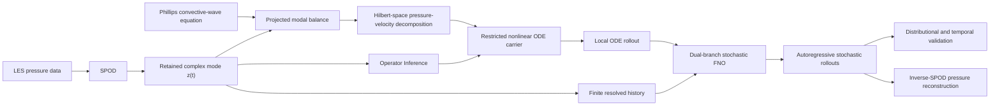

# Stochastic Fourier Neural Operators for Reduced-Order Modelling

**MSc Financial Mathematics Dissertation · Department of Mathematics · Brunel University London · 2026**

**Author:** Pradip Pokhrel  
**Supervisors:** Dr Matthias Winter and Dr Vasily Gryazev  

> Physics-guided stochastic operator learning for turbulent jet dynamics, applied to the NASA SHJAR SP7 jet.

This project develops a stochastic reduced-order modelling framework in which a history-conditioned **Fourier Neural Operator (FNO)** is coupled to a compact nonlinear **ODE carrier** derived from the governing aeroacoustic equations.

The model evolves the **leading axisymmetric SPOD pressure mode** at approximately \(St=0.0854\), with the deterministic carrier representing resolved local dynamics and the stochastic neural operator representing history-dependent variability associated with unresolved interactions.

The final, marked dissertation will be archived on **Zenodo** after assessment. A permanent DOI link will be added here when available.

---

## Visualisation

### Example stochastic ensemble reconstruction

**Ensemble mean and variability from the stochastic model**


The visualisation above comes from the original project development and illustrates the probabilistic nature of the model: the objective is not only to generate a single trajectory, but to reproduce the statistical structure of the retained turbulent wavepacket over autonomous rollouts.

---

## Thesis in one paragraph

Reduced-order models compress high-dimensional systems into a small number of variables, but the variables that are removed can continue to influence the retained dynamics through unresolved forcing and memory.

This dissertation starts from **Phillips' convective-wave equation**, projects the pressure dynamics onto a retained **spectral proper orthogonal decomposition (SPOD)** coordinate, and uses a Hilbert-space projection to separate the part of the unmeasured velocity fluctuations represented by the retained pressure-coordinate subspace from an orthogonal unresolved remainder.

That construction motivates a compact nonlinear ODE carrier whose effective coefficients are identified using **Operator Inference**. The remaining trajectory-level influence is represented by a finite-history stochastic FNO motivated by **Mori–Zwanzig projection** and conditional expectation. The complete model is evaluated through fully autoregressive stochastic rollouts, long-horizon statistics, phase-speed diagnostics, and inverse-SPOD pressure reconstruction.

---

## Core modelling idea



In short:

**LES → SPOD → aeroacoustic projection → ODE carrier → stochastic FNO → autonomous ensembles → statistical + reconstructed-field validation**

---

## Research question

**Can a compact physics-guided deterministic carrier be combined with a history-conditioned stochastic neural operator to recover the long-horizon statistics of a turbulent aeroacoustic mode when unresolved dynamics are not directly observed?**

A central result of the thesis is that **accurate local derivative prediction is not sufficient for accurate long-time statistics**.

The deterministic ODE is locally accurate, but its autonomous rollout does not preserve the reference amplitude behaviour. The stochastic closure is therefore not added merely as uncertainty decoration; it represents trajectory-level effects that are absent from the instantaneous reduced state.

---

## Main contributions

### 1. Pressure-velocity reduction for the aeroacoustic carrier

Starting from Phillips' convective-wave equation, SPOD projection produces a pressure-modal balance whose source retains velocity-gradient interactions.

Because the reduced data are pressure-only, the unmeasured velocity fluctuations are decomposed through Hilbert-space projection into:

- a component represented by the temporal span of the retained pressure coordinates; and
- an orthogonal unresolved remainder.

This identifies which interactions can be represented explicitly in the deterministic reduced model while retaining the remaining contributions in an unresolved residual.

### 2. Compact data-identified deterministic dynamics

The single-mode carrier uses the restricted feature dictionary

\[
[z,\ \dot z,\ z^2].
\]

Its effective coefficients are identified directly from the pressure-modal trajectory using **Operator Inference (OpInf)**.

The carrier is treated as a compact resolved drift rather than a complete closed model.

### 3. History-conditioned stochastic neural operator

The unresolved trajectory-level influence is represented by a finite-history FNO motivated by:

- Mori–Zwanzig projection;
- non-Markovian memory effects;
- conditional expectation; and
- conditionally centred stochastic innovation.

The neural operator is conditioned on both:

1. the recent resolved trajectory; and
2. a local rollout of the deterministic ODE carrier.

Training uses stochastic ensembles, continuous-adjoint sensitivities, and a multivariate **Energy Score**.

### 4. Long-horizon autonomous validation

The complete predictor is evaluated using:

- amplitude distributions;
- upper-tail behaviour;
- coefficient second moments;
- power spectral densities;
- temporal correlation scales;
- convective phase speed;
- inverse-SPOD pressure RMS fields;
- pressure-Laplacian RMS fields;
- spatial uncertainty; and
- outer-boundary wavenumber spectra.

---

## Key results

The stochastic evaluation uses **30 fully autonomous realizations**.

| Diagnostic | Result |
|---|---:|
| Deterministic held-out acceleration NRMSE | **6.83%** |
| Deterministic held-out \(R^2\) | **0.9953** |
| Deterministic autonomous envelope \(R^2\) | **−1.5944** |
| Amplitude-distribution overlap | **89.82%** |
| PSD cosine similarity | **0.9971** |
| 1/e correlation timescale | **5.48 vs 5.51 \(D_j/U_j\)** |
| Integrated correlation timescale | **4.50 vs 4.63 \(D_j/U_j\)** |
| Predicted 99th-percentile amplitude | **1513.91** |
| LES 99th-percentile amplitude | **1447.52** |
| Coefficient second-moment bias | **+28.58%** |
| Predicted phase speed | **0.6527 \(U_j\)** |
| Reference phase speed | **0.63 \(U_j\)** |
| Pressure RMS-field relative error | **5.65%** |
| Pressure RMS SSIM | **0.9984** |
| Reconstructed pressure mean-square bias | **−10.97%** |
| Pressure-Laplacian RMS relative error | **5.66%** |
| Pressure-Laplacian RMS SSIM | **0.9991** |
| Outer-boundary wavenumber-level offset | **≈ −0.50 dB** |

### Main empirical takeaway

The deterministic carrier reproduces **local modal acceleration** very accurately but is not, by itself, a satisfactory autonomous model.

Adding the stochastic history-conditioned operator allows the complete prediction pipeline to recover the main **distributional, spectral, temporal-correlation, upper-tail, phase-speed, and reconstructed-pressure characteristics** of the retained mode over long autonomous rollouts.

The main remaining coefficient-level discrepancy is the positive bias in the continuous-coefficient second moment. This quantity is distinct from reconstructed pressure mean square because inverse-SPOD synthesis combines overlapping complex windows whose relative phases can reinforce or cancel.

---

## Phase-speed consistency

The processed stochastic ensemble has a tracked temporal frequency of approximately **1596.76 Hz**.

Using the fixed LES-derived SPOD spatial mode:

- \(k_xD_j=-0.8602\)
- spatial phase-fit \(R^2=0.8427\)
- inferred phase velocity = **197.12 m/s**
- \(U_{\mathrm{phase}}/U_j=0.6527\)

The reference convective scale is approximately \(0.63U_j\), giving a relative difference of **3.60%**.

---

## Reconstructed pressure fields

The generated coefficients are converted back to real pressure using the same fixed retained SPOD spatial mode and window-weighted inverse-SPOD synthesis used for the reference.

### RMS pressure

- SSIM: **0.9984**
- relative spatial \(L_2\) error: **5.65%**
- maximum absolute error: **9.46 Pa**
- LES peak RMS pressure: **162.2 Pa**
- model peak RMS pressure: **152.7 Pa**
- RMS-map norm ratio: **0.9436**

### RMS instantaneous cylindrical pressure Laplacian

- SSIM: **0.9991**
- relative spatial \(L_2\) error: **5.66%**
- maximum absolute error: **\(7.27\times10^5\ \mathrm{Pa\,m^{-2}}\)**
- LES peak: **\(1.268\times10^7\ \mathrm{Pa\,m^{-2}}\)**
- model peak: **\(1.195\times10^7\ \mathrm{Pa\,m^{-2}}\)**

These comparisons assess temporal prediction **within the same fixed rank-1 SPOD spatial basis**; they are not claims of independently learning the complete acoustic radiation field.

---

## Methods and concepts

This work brings together:

`Aeroacoustics` · `Reduced-Order Modelling` · `SPOD` · `Operator Inference` · `Hilbert-Space Projection` · `Mori–Zwanzig` · `Generalized Langevin Modelling` · `Fourier Neural Operators` · `Stochastic Neural Operators` · `Continuous Adjoint Optimisation` · `Energy Score` · `Autoregressive Generation` · `Inverse SPOD` · `Uncertainty Quantification`

---

## Scope and limitations

The current study is intentionally focused on:

- one retained SPOD coordinate;
- the leading axisymmetric pressure contribution;
- one operating condition;
- one fixed LES-derived SPOD spatial mode; and
- rank-1 reconstructed pressure comparisons.

The thesis therefore does **not** claim:

- recovery of the full turbulent flow state;
- identification of each unresolved physical source term;
- exact recovery of the Mori–Zwanzig memory kernel;
- independent learning of a complete spatial radiation operator; or
- universal performance across frequencies, modes, or operating conditions.

The stochastic closure represents the **combined trajectory-level influence** of interactions omitted from the explicit ODE carrier.

---

## Thesis structure

**Chapter 1 — Introduction and Modelling Objectives**  
Motivation, reduced-order closure problem, proposed framework, and main contributions.

**Chapter 2 — Derivation of the Governing Aeroacoustic ODE**  
Derivation from Phillips' convective-wave equation, SPOD projection, pressure-velocity decomposition, and Operator-Inference carrier.

**Chapter 3 — Stochastic Reduced-Order Modelling and Non-Markovian Neural Operators**  
Mori–Zwanzig motivation, conditional-expectation formulation, stochastic learning, and history-conditioned neural operator.

**Chapter 4 — Computational Architecture and Network Topology**  
SPOD coordinate extraction, data processing, network architecture, training, stochastic generation, and implementation details.

**Chapter 5 — Results and Empirical Validation**  
Deterministic accuracy, stochastic amplitude statistics, spectra, correlation scales, intermittency, phase speed, reconstructed pressure, pressure Laplacian, and spatial diagnostics.

**Chapter 6 — Conclusions and Future Work**  
Main findings, limitations, and extensions to multimode and broader reduced-order settings.

**Appendix A — Computational and Reproducibility Details**  
Implementation conventions, algorithms, numerical processing, reconstruction details, and computational information.

---

## Future directions

Natural extensions include:

- jointly evolving multiple SPOD coordinates;
- modelling cross-mode dependence and relative phase;
- including multiple frequencies and azimuthal modes;
- testing POD and other reduced representations;
- modelling multiple operating conditions;
- learning richer spatial/radiation mappings; and
- developing more explicit approximations to unresolved memory dynamics.

---

## Dissertation archive

The **final marked version** of the dissertation will be uploaded to **Zenodo** after assessment.

When available, this section will contain:

- the permanent Zenodo DOI;
- the archival citation; and
- a direct link to the full thesis.

---

## Citation

Until the archival DOI is available, the dissertation can be referenced as:

> **Pokhrel, P. (2026).** *Stochastic Fourier Neural Operators for Reduced-Order Modelling*. MSc dissertation, Department of Mathematics, Brunel University London.

```bibtex
@mastersthesis{pokhrel2026stochastic,
  author  = {Pokhrel, Pradip},
  title   = {Stochastic Fourier Neural Operators for Reduced-Order Modelling},
  school  = {Brunel University London},
  type    = {MSc Dissertation},
  year    = {2026}
}
```

The Zenodo DOI will be added after the final marked dissertation is archived.

---

## Authorship

This dissertation is the author's MSc research project. The mathematical formulation, modelling decisions, implementation, analysis, interpretation, and final dissertation remain the author's responsibility.

Generative AI was used as a supporting tool for consistency checks, writing, and coding, as disclosed in the dissertation; the author reviewed the material and takes responsibility for the final work.

---

## Contact

For questions about the project or related research, please use the contact details associated with the author's GitHub profile.
